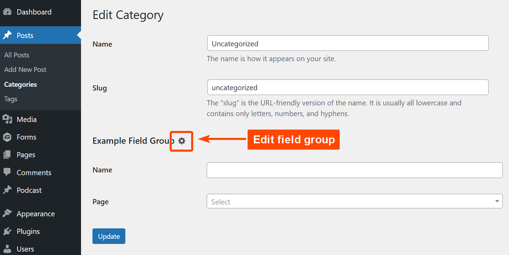

# RS ACF Improvements (WordPress Plugin)

This plugin adds a link to edit field groups on user profiles and 
taxonomy term pages. This behavior is similar to the post edit link 
that appears on the admin bar when viewing a post.

(Because for some reason ACF never added equivalent links for field 
groups on user profiles or term pages.)



```
Contributors: radgh
Requires at least: 6.0
Tested up to: 6.7
Requires PHP: 8.0
License: GPLv3
License URI: http://www.gnu.org/licenses/gpl-3.0.txt
```

## Changelog

### 1.0.0
* Initial release